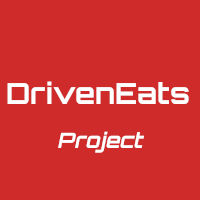
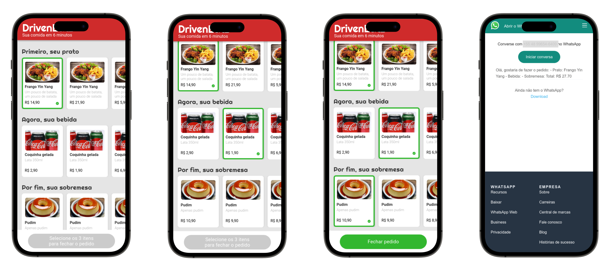

<p align="center">
  <a href="https://raferdev.github.io/driveneats/">
 </a>
</p>

<h3 align="center">DrivenEats</h3>

<div align="center">

[]()
[](https://github.com//raferdev/globo.com/issues)
[](https://github.com/raferdev/globo.com/pulls)
[](/LICENSE)

</div>

---



<p align="center"> This is a HTML + CSS + Javascript project based on <a href="https://www.ifood.com.br/">Ifood App</a> style with focus on training javascript logic and interation with another apps.
</p>

## 📝 Table of Contents

- [About](#about)
- [Getting Started](#getting_started)
- [Usage](#usage)
- [Built Using](#built_using)
- [Authors](#authors)

## 🧐 About <a name = "about"></a>

This project i use to training the Javascript logic. I have to integrate logic with css styles to give for users the better experience. Isn't a reponsive layout and its build to better experience is in 600px width scale.

## 🏁 Getting Started <a name = "getting_started"></a>

You can clone the project and start on your local host or open the site hospeded <a href="https://rafaelfernandev.github.io/driveneats/">here</a>

Clone

 ```
 git clone https://github.com/raferdev/instagram
 ```

## 🎈 Usage <a name="usage"></a>
You can right click and go to option inspect on your browser to use the options sizes of display and set the better width. You can select options and see the logic, when you select 3 options and click on 'Fechar Pedido', you will be redirected to whatsapp website with custom message.

## ⛏️ Built Using <a name = "built_using"></a>

- [HTML](https://developer.mozilla.org/pt-BR/docs/Web/HTML) - Markup Language
- [CSS](https://developer.mozilla.org/pt-BR/docs/Web/CSS) - Style Language

## ✍️ Authors <a name = "authors"></a>

- [@raferdev](https://github.com/raferdev) - Idea & Initial work
